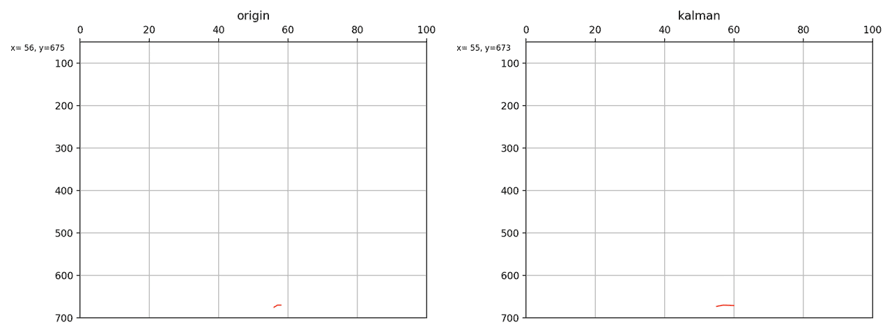

# 基于yolov4的实验老鼠轨迹检测

## 网络结构

基于pytorch+cuda框架开发

总体框架使用yolov4

* backbone使用ghost
* neck部分使用mobilenetv2的InvertedResidual替换卷积层
* 跟踪使用SORT(simple online realtime track)

模型由yolov4的240M->30M.Neck SPP部分不变.FPN部分减少了特征层层数.Head部分还暂未修改

跟踪只是基本的卡尔曼滤波+匈牙利匹配,匈牙利匹配是根据iou,这段刚开始准备.准备移植deep sort的马氏距离

## 效果

稍微倾斜的老鼠也能识别出来

**PS**:`mouse_ID1_0.99`,ID1表示的是老鼠的ID,跟踪框跟上后会给每个目标一个独立的ID

# SORT跟踪

## 卡尔曼滤波的效果

看一个简化版本的滤波效果.左边为原始检测器输出,右边为卡尔曼滤波之后的结果,可以看到曲线明显平滑了.

本图片对应的数据存放在`track/origin.txt`和`track/kalman.txt`,每一行内容为:目标的[左上角x1y1,左下角x2y2,label,conf].生成代码对应`track/track.py`.

# 修改记录

## 2022.03.13

首次初始化仓库

# 感谢

主体yolo部分代码参考

* https://github.com/bubbliiiing/yolo4-pytorch
